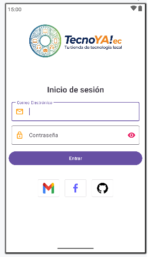
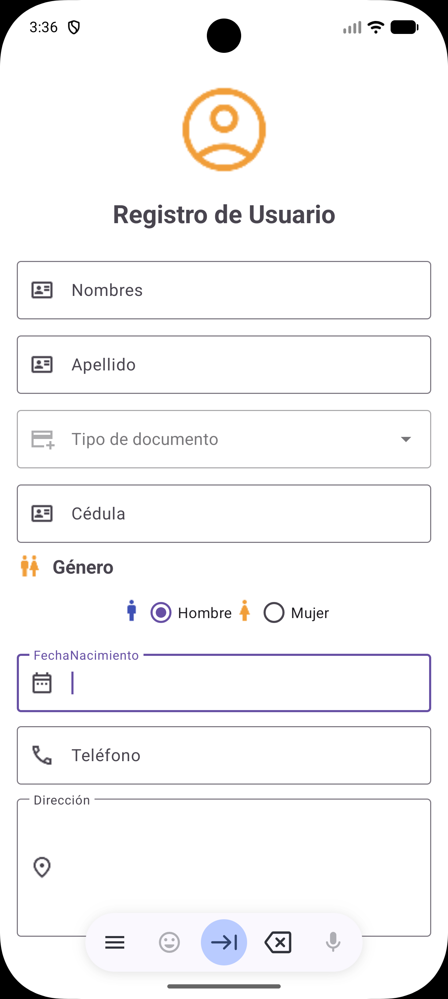

# Práctica 1 - Interfaz Gráfica de Usuario

Este es un proyecto de aplicación Android desarrollado en Kotlin que permite el registro detallado de usuarios, utilizando componentes de Material Design y animaciones Lottie.




## 📋 Características

La aplicación cuenta con un formulario de registro completo que incluye:
- **Datos Personales:** Nombres y apellidos.
- **Identificación:** Selección de tipo de documento (Dropdown) y número de cédula.
- **Género:** Selección mediante botones de opción (RadioButtons) con iconografía.
- **Fecha de Nacimiento:** Campo con soporte para fecha.
- **Contacto:** Teléfono y dirección multilínea.
- **Interfaz Moderna:** Uso de `TextInputLayout`, `MaterialComponents` y animaciones con `Lottie`.

## 🛠️ Tecnologías Utilizadas

- **Lenguaje:** Kotlin
- **Diseño de Interfaz:** XML (ConstraintLayout)
- **Componentes:** Google Material Design
- **Animaciones:** [Lottie Android](https://github.com/airbnb/lottie-android)
- **Mínimo SDK:** 34
- **Target SDK:** 36

## 📂 Estructura del Proyecto (Puntos Clave)

- `app/src/main/java/com/uteq/software/app1/`: Contiene la lógica de las actividades (ej. `actRegistroUsuario.kt`).
- `app/src/main/res/layout/`: Archivos XML de diseño, incluyendo `activity_act_registro_usuario.xml`.
- `app/src/main/res/drawable/`: Recursos gráficos e iconos para el formulario.
- `app/src/main/res/raw/`: Archivos de animación Lottie (ej. `robot.json`).

## 🚀 Instalación y Configuración

1. **Clonar el repositorio:**
   ```bash
   git clone https://github.com/tu-usuario/App1_UI.git
   ```
2. **Abrir en Android Studio:**
   Selecciona la carpeta raíz del proyecto.
3. **Sincronizar Gradle:**
   Asegúrate de que todas las dependencias se descarguen correctamente.
4. **Ejecutar:**
   Selecciona un emulador o dispositivo físico con API 34 o superior.


